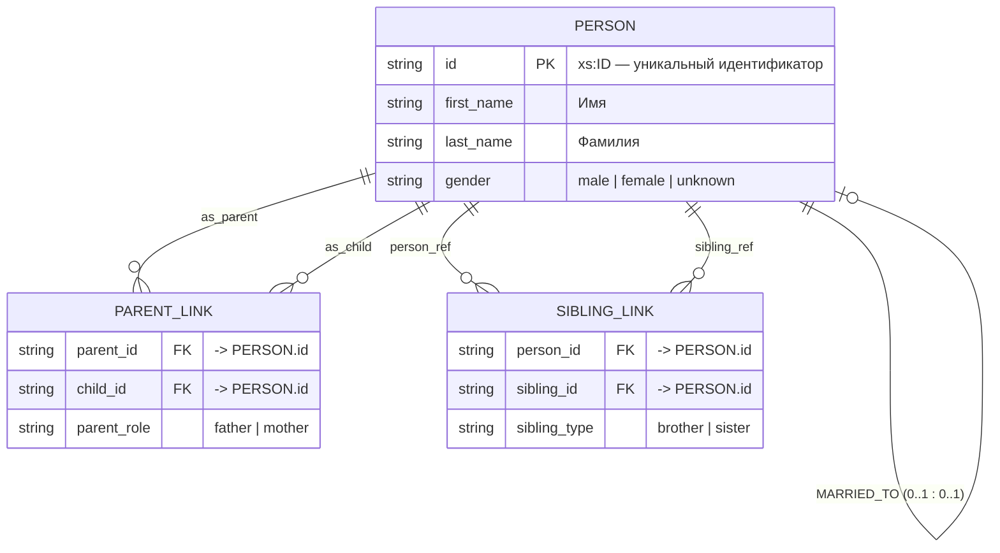

# ER-диаграмма (Chen notation)

## Таблица атрибутов PERSON

| атрибут | домен | ограничение |
|---------|-------|-------------|
| id | VARCHAR(50) | NOT NULL, PRIMARY KEY |
| first_name | VARCHAR(250) | NULL |
| last_name | VARCHAR(250) | NULL |
| gender | ENUM('M','F','U') | NULL, CHECK (gender IN ('M','F','U')) |

## Доменные ограничения для связей

- **MARRIED_TO (0..1 : 0..1)**: супруги разного пола (если gender известен); связь симметрична
- **PARENT_LINK**: у ребёнка не более 2 родителей; отец → gender='M', мать → gender='F'; связь "родитель → ребёнок" имеет кардинальность 0..N : 0..2
- **SIBLING_LINK**: симметричная связь (если A sibling B, то B sibling A); кардинальность 0..N : 0..N